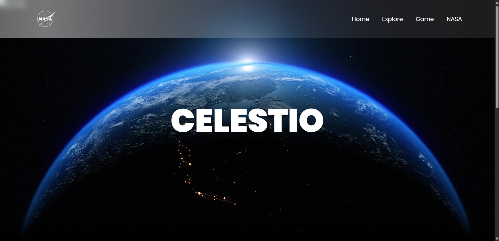

# CELESTIO 🌌

CELESTIO is an educational and visually engaging web application built for the **NASA International Space Apps Challenge Hackathon**. It empowers users to explore and learn about celestial movements, near-Earth objects, and space science through interactive visualization and real-time data integration.

 (https://mitesh2427.github.io/CELESTIO/)

---

## ✨ Project Overview

This project was created during the [NASA Space Apps Challenge](https://www.spaceappschallenge.org/), the world's largest global hackathon, which engages thousands of participants worldwide to solve real challenges related to Earth and space.

**CELESTIO** aims to:
- Bring space closer to the general public.
- Make learning about space science more accessible.
- Provide an engaging, interactive experience for space enthusiasts and educators.

---

## 🌠 Features

✅ **Interactive Landing Page**
- Parallax hero section with stunning space imagery.

✅ **Explore Section**
- Educational content about celestial objects.

✅ **Game Integration**
- A space-themed game to make learning fun.

✅ **Real-Time Data Links**
- Direct access to NASA data and resources.

✅ **Responsive Design**
- Optimized for desktop and mobile devices.

---

## 🚀 Project Structure

```
project-root/
├── templates/
│   ├── index.html        # Main landing page
│   ├── ab.html           # Explore page
│   ├── abc.html          # (Another page, if applicable)
│   └── game3.html        # Game page
├── static/
│   ├── css/
│   │   └── landing.css   # Stylesheet
│   ├── js/
│   │   └── landing.js    # JavaScript logic
│   └── images/
│       ├── nasa.png
│       ├── parallax/
│       │   └── (Parallax background images)
│       └── gallery/
│           └── (Image gallery images)
└── README.md
```

## 🛠️ Technologies Used

- **HTML5**
- **CSS3**
- **JavaScript (ES6)**
- **Boxicons & Font Awesome**

---

## 🌍 External Resources

- [NASA Official Website](https://www.nasa.gov/)
- [NASA Space Apps Challenge](https://www.spaceappschallenge.org/)
- [Boxicons](https://boxicons.com/)
- [Font Awesome](https://fontawesome.com/)

---
